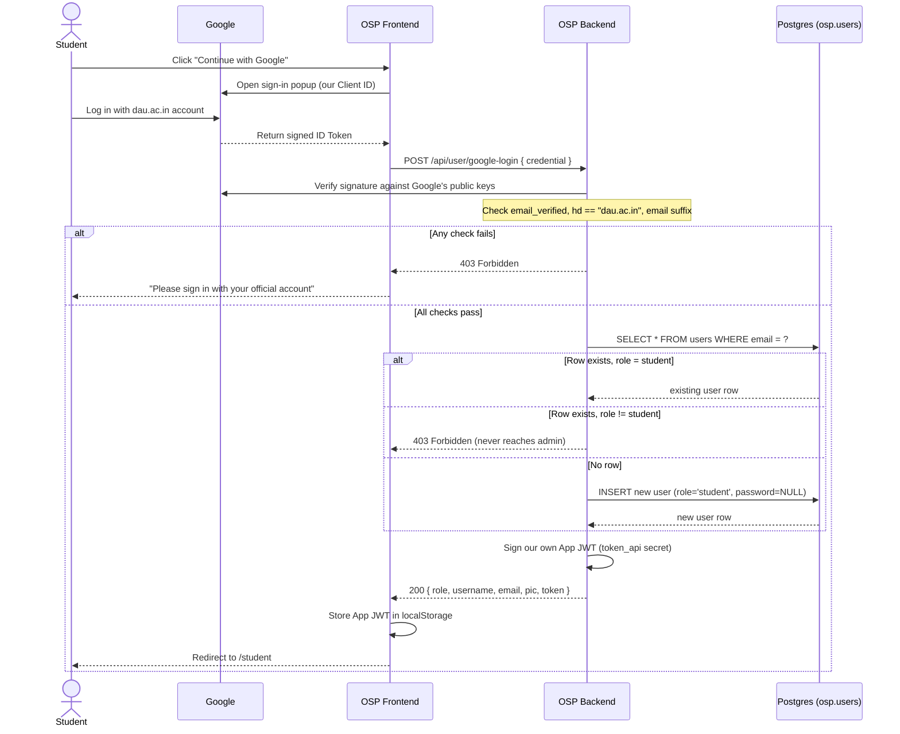
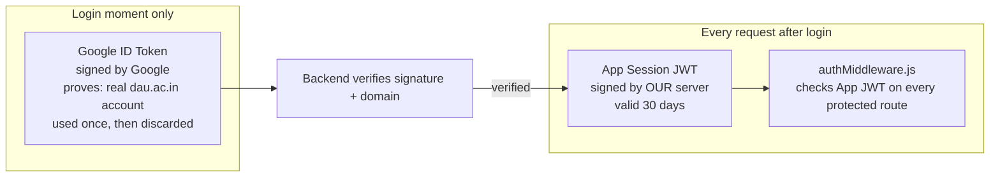

# Google OAuth for Students — How It Works, Explained Simply

This doc exists so you can explain the Google Sign-In feature confidently —
what it does, why every piece exists, and how to draw it. Not pushed to git
yet, per your instruction — it's a local reference until you're ready.

---

## The one-line answer to "are we still using JWT?"

**Yes — and there are two completely different JWTs involved, which is
probably what's making this feel confusing.** Once you see them as two
separate things with two separate jobs, it clicks:

| | Google's ID Token | Our App's Session Token |
|---|---|---|
| **Who signs it** | Google | Our own server (`token_api` secret) |
| **Proves** | "This person really did just log into a real `dau.ac.in` Google account" | "This browser already logged in — let them through" |
| **Lifetime** | Used once, in the split second of login, then thrown away | 30 days, stored in `localStorage`, sent on every request |
| **Where it's checked** | `config/googleClient.js`, once, during `/google-login` | `middleware/authMiddleware.js`, on every protected route |

So: Google Sign-In did **not** replace JWTs. It replaced the *password
check*. The thing that actually keeps you logged in as you click around the
site afterward is still exactly the same kind of app-issued JWT that
password login has always used (`config/generateToken.js`) — Google
sign-in just became a second, stronger way to *earn* that token instead of
typing a password.

---

## Why this exists at all

Before this feature, `registerUser.js` let anyone type **any** email
address and password — nothing proved the person typing `someone@dau.ac.in`
actually had access to that mailbox, let alone was really a DAU student.
Google Sign-In fixes that by outsourcing identity proof to Google: DAU
students already have real Google Workspace accounts under `dau.ac.in`
(this is what "Google Workspace" means — Google is DAU's actual email
provider), so if someone can complete a Google login for that domain, they
really do hold that identity. We didn't invent any new security machinery
— we just stopped trusting a text box and started trusting Google's
already-existing, already-trusted login system.

---

## Concepts glossary (the vocabulary to have ready)

- **OAuth 2.0** — a standard way for one app ("relying party" — that's us)
  to ask another service ("identity provider" — Google) *"can you vouch for
  this person?"* without ever seeing that person's Google password. We
  never touch, see, or store a Google password. Google does the
  authentication; it just tells us the result.
- **Client ID** — a public identifier Google issues to *our specific app*
  so it knows who's asking (`309694190241-....apps.googleusercontent.com`).
  Not a secret — it's baked right into the frontend JavaScript bundle
  (`REACT_APP_GOOGLE_CLIENT_ID`), same as any "Sign in with Google" button
  on any site.
- **ID Token** — the actual proof Google hands back after a successful
  login. It's a JWT *Google* signs (not us), containing claims like the
  user's email, whether that email is verified, and (critically for us)
  their Google Workspace domain.
- **Claim** — one fact inside a JWT's payload. `email`, `email_verified`,
  and `hd` are all claims on Google's ID token.
- **`hd` claim** ("hosted domain")** — the one Workspace-specific claim
  that makes domain-restriction possible: for a Workspace account, Google
  stamps the organization's domain right into the token (`hd: "dau.ac.in"`).
  A personal Gmail account has no `hd` claim at all, which is exactly how
  we tell the two apart.
- **Signature verification** — the actual security step. Anyone can *claim*
  `hd: "dau.ac.in"` by typing JSON into a request — that's not proof of
  anything. The proof is that Google cryptographically signed the token
  with a private key only Google holds, and our backend checks that
  signature against Google's published public keys before trusting a
  single claim inside it. This is the one step that turns "the client says
  so" into "Google says so," which is the whole point of doing this
  server-side instead of trusting the frontend.

---

## The end-to-end flow

1. Student clicks **"Continue with your dau.ac.in account"** on the login
   page (`LoginRegister.jsx`).
2. `@react-oauth/google`'s `GoogleLogin` component opens Google's own
   sign-in popup — the student authenticates *directly with Google*, our
   page never sees their Google password.
3. Google returns an **ID Token** to the browser (called `credential` in
   the code).
4. The frontend POSTs `{ credential }` to `POST /api/user/google-login` —
   a public endpoint (no login required to call it — this call *is* the
   login).
5. `googleAuth.js` on the backend:
   - Verifies the token's signature via `google-auth-library`
     (`config/googleClient.js`) — proves it's real, unmodified, and issued
     for *our* Client ID specifically (not some other app's).
   - Checks `email_verified === true`, `hd === "dau.ac.in"`, **and** the
     email string itself ends in `@dau.ac.in` — three independent checks
     on purpose, so a bug in any one of them alone can't become a bypass.
   - Looks up `osp.users` by that email.
     - **Existing row, `role = 'student'`** → log into that same account.
     - **Existing row, any other role** (e.g. an admin) → **rejected**,
       even though the Google login itself was completely valid. This is
       the rule that guarantees Google sign-in can never reach an admin
       session.
     - **No row at all** → a new student account is created right there,
       `password = NULL` (they have no password — they never will unless
       they separately use the password flow).
6. The backend signs **our own** JWT — the app session token, same
   `generateToken()` function password login already used — and returns
   it in the same response shape `/api/user/login` always returned.
7. The frontend stores that token in `localStorage` exactly like a normal
   login, and every request after this point (`authMiddleware.js`) checks
   *that* token — Google is completely out of the picture from here on.

---

SEQUENCE DIAGRAM:

## Concept diagram

---

## Questions you'll probably get asked

**"Why not just check the email domain on the frontend and skip the
backend verification?"**
Because the frontend is just JavaScript running in the student's own
browser — they could open dev tools and send any request they want,
claiming to be any email. The signature check is the only step that can't
be faked from the client side; everything else is a convenience, not
security.

**"What stops someone from making an admin account through this?"**
Two things, stacked: (1) new accounts created through this path are always
hardcoded to `role: 'student'`, never configurable by the request — there's
no code path that can create an admin row here at all. (2) Even if an
*existing* row happened to be an admin with a matching `dau.ac.in` email,
the role check rejects the login before issuing a token. Admin accounts
are still only ever created by direct database access, same as before this
feature existed.

**"What happens the second time someone signs in?"**
Exactly the same request — `SELECT ... WHERE email = ?` finds their
existing row instead of creating a new one, so "sign up" and "log in" are
literally the same button, same endpoint, same code path. That's why there
was no separate signup step for you to notice.

**"Does this replace the password login?"**
No — it's additive. Students get Google-only (the password form isn't even
shown for the Student role anymore); admins still use the original
email+password form, completely untouched by this feature.

**"Why is `password` nullable now?"**
Because a Google-only account has no password — there's nothing for the
student to type, ever, unless they separately reset one. That required a
one-line migration (`ALTER TABLE users ALTER COLUMN password DROP NOT
NULL`) since the column started as `NOT NULL`.
